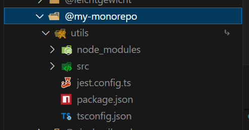

在软件开发中，代码仓库的管理对项目的开发🧐和协作👥有着很重要的作用。常见的管理方式有`Monorepo（单体仓库）`和`Multirepo（多体仓库）`两种。

# `Multirepo`的痛点😖

`Multirepo`是使用单独仓库对单独项目进行管理，项目中的文件被放在不同的仓库中，这正是我们大多数开发所使用的代码管理方式；

痛点：

1. 依赖问题😖
    
    如果每个项目代码都安装依赖，都会产生`node_modules`这样的文件，项目体积变大；
    
    如果更新依赖需要每个项目都进行更新，其中一个出现错误，其他项目可能也会出现相同的错误❌，需要同时更改多个文件；
2. 重复配置
    
   `package.json`、Eslint、Prettier、Typescript等多种工具或语言的配置需要在每个项目都进行配置，特别麻烦❗️

3. 跨仓库重构困难
    
    当遇到重构某个接口任务时需要同时修改多个项目的代码，一个简单的重构任务变成了跨仓库的大工程🏗️

# `Monorepo`介绍
而`Monorepo`是使用一个仓库对多个项目进行管理的项目管理策略，嫩个很好的解决`Muitirepo`的这些痛点❗️

1. 共享依赖，统一版本
   `Monorepo`项目的依赖统一在根目录下，所以相关的项目使用`硬链接`链接到根目录下的`node_modules`;
   
   当依赖更新时，所有项目的依赖都会更新，不需要单独更新；
2. 统一配置
   我们都知道代码环境的配置是很麻烦的，使用`Multirepo`就需要重复配置多次，而`Monorepo`只需配置一次就可多个项目共享。
   
3. 一次重构，原子提交
   当修改了一个共享工具函数之后，可能需要更新多个地方，但是在`Monorepo`就可以一次更新（原子提交），就可以同时修改所有依赖它的项目。


比如说一个项目同时有`UI`组件库，工具库，服务器端代码，客户端代码等多项目代码，那么这个项目的结构就是这样的

```go
my-project/
├──  node_modules
├──  ui-compoonents # UI组件库
| ├──package.json
├──  utils-library # 工具库
| ├──package.json
├──  shared-types # 共享类型
| ├──package.json
├──  admin-dashboard # 后台管理
| ├──package.json
└──  marketing-site # 官网
| ├──package.json
├── pnpm-workspace.yaml
└── package.json
```

# 创建`Monorepo`项目

首先创建项目：

```bash
mkdir my-monorepo
cd my-monorepo
pnpm init
```

## 🫀核心文件 `pnpm-workspace.yaml`
接着创建文件`pnpm-worspace.yaml`，这个是`Monorepo`的🫀核心文件，它告诉`pnpm`哪些是要管理的子项目。配置：
```bash
packages:
- 'packages/*'
- 'app/*'
```

得到：
```go
my-monorepo/
├── package.json
└── pnpm-workspace.yaml
```

好，现在来创建子项目：

```bash
mkdir packages/utils
cd packages/utils
pnpm init
```

进行`packages.json`的配置：
`name`我们统一配置为`@[项目名]/[子项目名]`，这样更规范一点
```json
{
  "name": "@my-monorepo/utils",
  "version": "1.0.0",
  "description": "",
  "main": "index.js",
  "scripts": {
  },
  "keywords": [],
  "author": "",
  "license": "ISC",
  "packageManager": "pnpm@10.18.3"
}
```

现在可以再创建一个子项目：

```bash
mkdir packages/web-app
cd packages/utils
pnpm init
```

同样地，进行`packages.json`的配置：
`name`我们统一配置为`@[项目名]/[子项目名]`，这样更规范一点
```json
{
  "name": "@my-monorepo/web-app",
  "version": "1.0.0",
  "description": "",
  "main": "index.js",
  "scripts": {
     "dev": "vite --mode dev"
  },
  "dependencies": {
     "@my-monorepo/utils": "workspace:*"
  },
  "keywords": [],
  "author": "",
  "license": "ISC",
  "packageManager": "pnpm@10.18.3"
}
```

像这样，我们直接在子项目中通过`dependencies`引入，就可以使用了。

## 增加便捷命令：
在根目录下的`packages.json`
```json
{
   "script": {
      "dev": "pnpm -F react-app dev",
      "build": "pnpm -F react-app build",
      "preview": "pnpm -F react-app preview"
   }
}
```
这样在根目下就能直接启动某个子项目了。

我们接着来认识一下`Turborepo`🔧

## `Turborepo`
`Turborepo`是`Vercel`出品的高性能`Monorepo`构建工具，可以用来管理多项目依赖，并行任务，完美适配React/Vue/Next.js框架

对比直接使用`pnpm`，`Turborepo`的优点有：
1. 多任务并行 -- 可同时启动多个子项目
2. 构建速度快 -- `Turborepo`有缓存机制，能够更快的启动和打包
3. ...

所以更推荐选择使用`pnpm`+`Turborepo`来构建和管理我们的`Monorepo`项目。

## 引入`Turborepo`

如果跟我一样先创建了项目，又想使用`Turborepo`，那么就可以跟着我这样做：
```bash
# monorepo 根目录
pnpm add -D @turbo/gen turbo -w
```

接着在根目录`package.json`中配置：
```json
{
  "name": "my-monorepo",
  "workspace": [
    "app/*",
    "packages/*"
  ],
   "scripts": {
      "dev": "turbo run dev", // 启动所有项目
      "build": "turbo run build", // 构建所有项目
      "dev:web": "turbo run dev --filter=\"{@my-monorepo/web_app}\"", // 启动@my-monorepo/web_app子项目
      "build:web": "turbo run build --filter=\"{@my-monorepo/web_app}\"" // 构建@my-monorepo/web_app子项目
   },
   "devDependencies": {
      "@turbo/gen": "^2.5.8",
      "turbo": "^2.5.8"
   }
}
```
但也可以只配置子项目的`package.json`，当在根目录执行`turbo [xxx]`，turbo会自动在所有子项目中`package.json`中寻找名为`...`的命令，比如某子包的`package.json`：
```json
{
   "scripts": {
      "start": "react-scripts start",
      "build": "react-scripts build",
      "test": "react-scripts test",
      "eject": "react-scripts eject"
   }
}
```
就可以在根目录下执行

## 在子项目引入工具包
在子项目`package.json`中添加依赖：
```json
{
  "devDependencies": {
    "@my-monorepo/utils": "workspace:*"
  }
}
```

之后执行`pnpm install`，就会发现依赖已经被链接到`node_modules`中了。



# ❗️注意
1. `Monorepo`结构下所有子项目都必须安装`eslint`，而且最好在8.x版本，不然可能会有`unmet peer`警告
   ```bash
   pnpm add eslint@latest -w --save-dev # 为所有子项目安装eslint到最新版本     -w / --workspace表示“对工作区内所有子包执行安装”
   npx eslint --init # 选择 React/TypeScript 等配置，生成 .eslintrc.js
   pnpm add eslint@8.57.0 --save-dev
   ```


