# Git 概述
## Git 版本控制器的方式
- **`集中式版本控制`**
> 集中式版本控制工具的版本库是集中放置在中央服务器的，团队中的每个人先从版本库中下载代码（需要联网才能工作），个人修改后提交到中央版本库。
> 例：`SVN` 和 `CVS` 

- **`分布式版本控制`**
> 分布式版本控制系统没有“中央版本库”，每个人电脑上都是一个完整的版本库，这样工作的时候就不需要联网了。版本都在自己电脑上，修改后只要提交到仓库就可以实现多人协作。
> 例：`Git`

## Git 工作流程
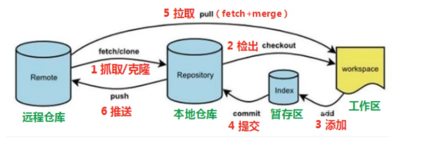
**相关命令：**
1. `clone（克隆）`：从仓库代码中克隆代码到本地仓库
2. `checkout（检出）`：从本地仓库检出一个分支进行修订(也就是切换分支)
3. `add（添加）`：将修改的文件添加到暂存区
4. `commit（提交）`：将暂存区中的文件提交到本地仓库
5. `fetch（抓取）`：从远程库住去到本地仓库，不进行其他的合并动作
6. `pull（拉取）`：从远程库拉取最新代码，自动进行合并(merge)，相当于`fetch`和`merge`
7. `push（推送）`：将本地仓库推送到远程仓库

# Git 安装与常用命令
常用Linux命令：
1. ll / ls：查看当前目录下的文件
2. cat：查看文件内容
3. touch：创建文件

## Git 环境配置

### 安装
> 安装地址：https://git-scm.com/downloads

傻瓜式安装后后见点击桌面出现图示红框中内容即为成功安装。
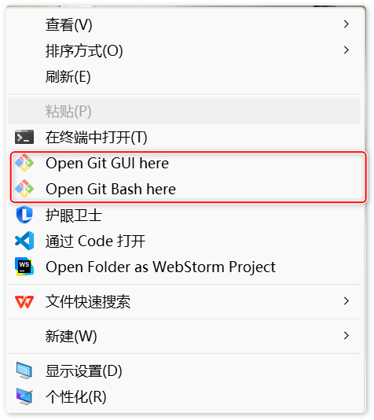

**注：**
`Git GUI`：Git图形化管理工具
`Git Bash`：Git命令行工具

### 基本配置
安装完Git后首先是要全局配置email和用户名，每次提交代码时都会使用到！全局配置可以省去每次提交代码时都要输入email和用户名
1. 设置用户信息
    > git config--global user.name "你的用户名"
    
    > git config--global user.email "你的邮箱"
2. 查看用户信息
   > git config--global user.name
   
    > git config--global user.email

### 常用命令配置
1. 打开电脑用户目录：C:\Users\你的用户名
    > 部分windows用户不允许用户创建点号开头的文件，可以打开`gitbash`执行: `touch ~/.bashrc`
2. 在`.bashrc`文件中添加如下内容：
    > 用于输出git提交日志
   > alias git-log="git log --pretty=oneline --all --graph --abbrev-commit"  

3. 打开gitBash，执行`source ~/.bashrc`
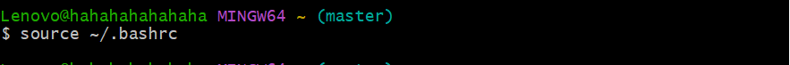

### 解决git乱码问题
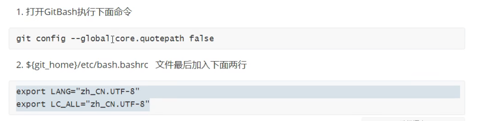

## 获取本地仓库
在工作目录打开git bash 输入`git init`，若出现.git文件夹这证明获取本地仓库成功。

## 基础操作指令
Git工作目录下对于文件的修改（新增、更新、删除）会存在几种状态，这些修改的状态会随着我们执行Git命令而发生改变。
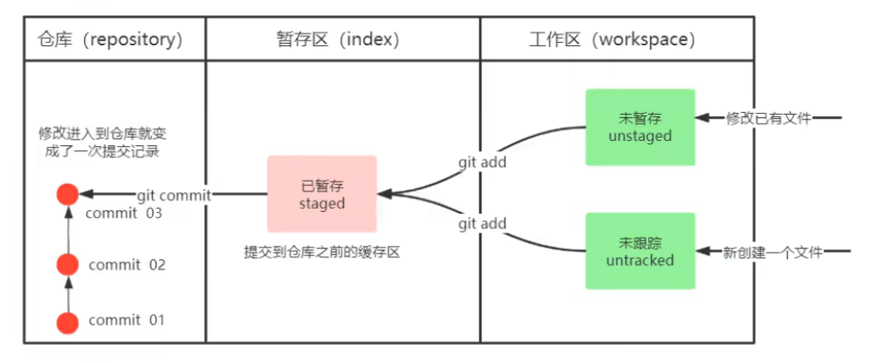

1. **查看修改状态**  ---  查看修改的状态（暂存区、工作区）
    > git status

2. **添加工作区到暂存区**
   > 将文件提交到当前仓库的暂存区
   > git add 文件名 | 通配符
   > 例：git add 'file01.txt'    或者    git add .
3. **提交暂存到本地仓库**
   > 将暂存区中的文件提交到当前仓库的当前分支
   > git commit -m '提交信息'

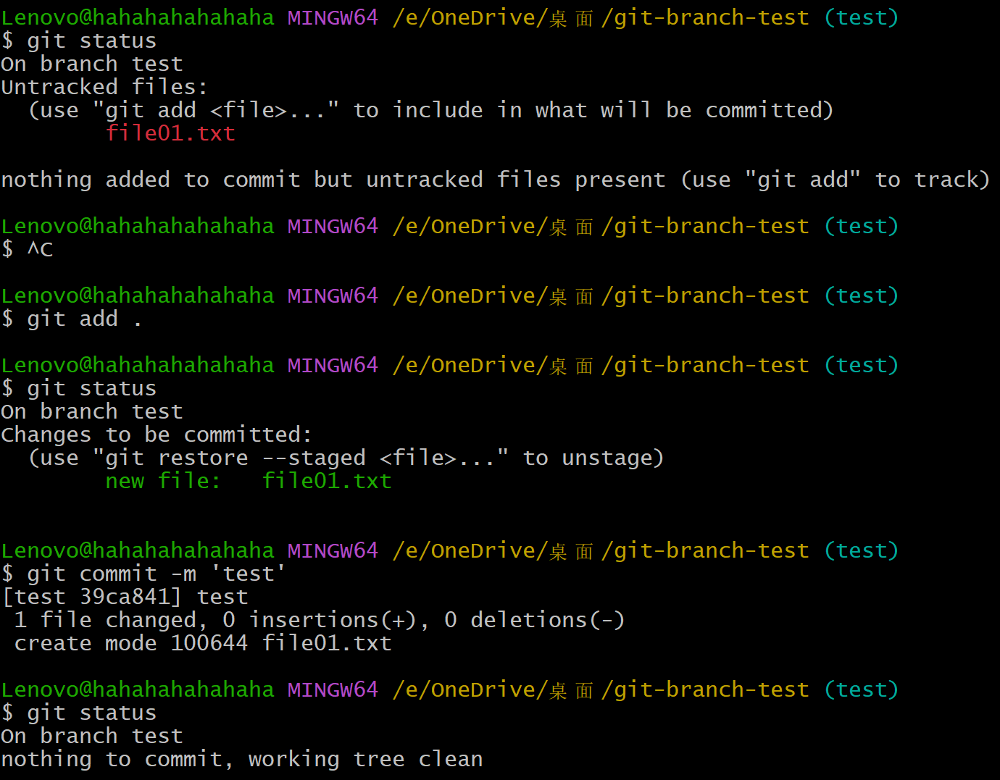

4. **查看提交日志**
    > git log [options]
    
    > options:

         > --all  输出全部的提交日志
         > --pretty=oneline  提交日志在一行输出
         > --abbrev-commit  使得输出的commitId更简短
         > --graph  提交日志以图的形式显示
5. 版本回退
    > git reset --hard commitId    （commitId可以通过`git log`或者之前设置的`git-log`进行查看）

    > 如何查看已经删除的记录
    > git reflog

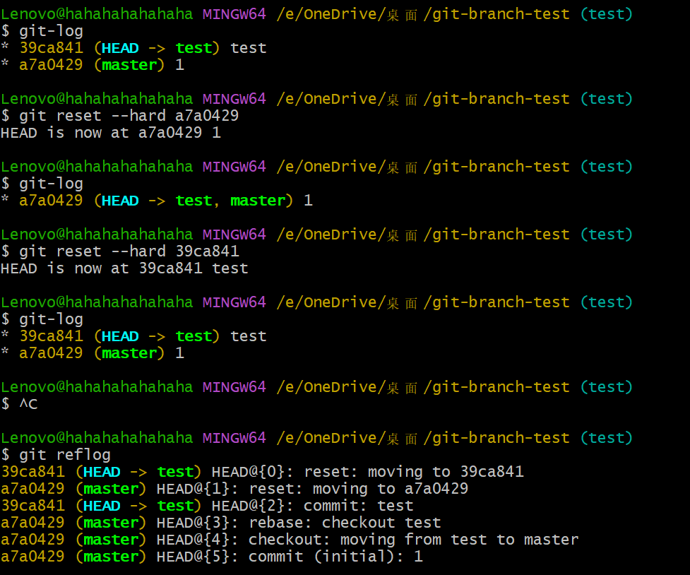

6. 添加文件到忽略列表
    工作目录中的有些文件无需纳入到git仓库中，比如node_modules等文件，这时我们可以新建一个`.gitignore`文件，将需要忽略的文件名写入到该文件中即可。下面是一个`.gitignore`文件示例：
    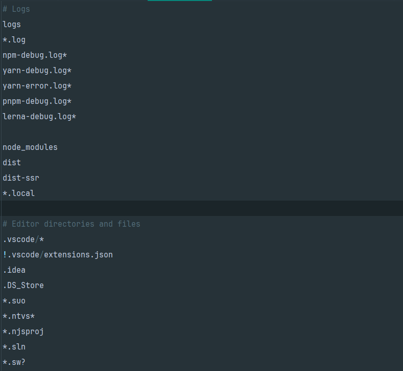
    

## 分支
使用分支以意味着你可以把你的工作从开发主线上分离开来进行重大的bug修改、开发新的功能，以免影响主线开发。

### 分支常用命令
1. 查看分支
   - `git branch`
2. **创建分支**
   - `git branch 分支名`
   
3. 上面我们所配置的命令别名`git-log`
4. 切换分支
   - `git checkout 分支名`   
   - `git checkout -b 分支名`(可直接切换到一个不存在的分支名，Git会自动创建一个分支名并切换到该分支名)
    
   从Git 2.23版本开始，引入了`git switch` 命令来专门切换分支，这使得切换分支的命令更加清晰和直观。
    - `git switch 分支名`
    - `git switch -c 分支名`   (创建并切换到新分支)
5. 合并分支
   - 将分支名分支合并到当前分支
   - `git merge 分支名`
   
   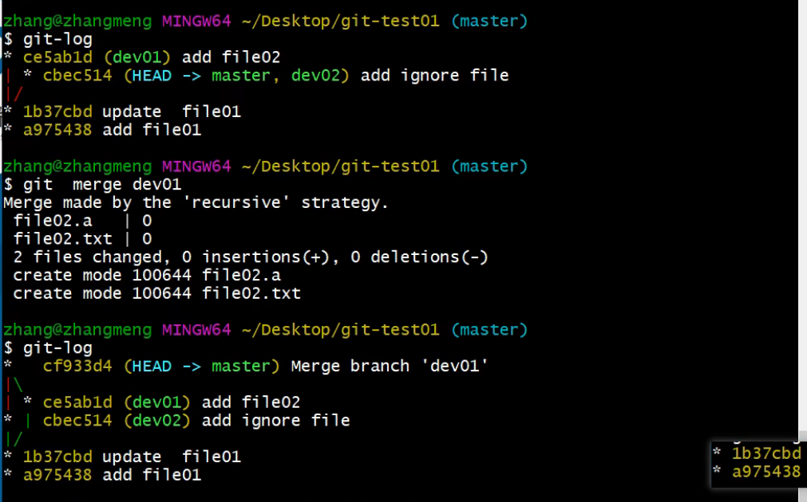
6. 删除分支 
   - `git branch -d 分支名`

## 开发中分支使用原则与流程
使用分支可以将你的工作与主线分支分离开，避免在修改重大的bug、开发新的功能等情况下影响主线开发。

- **`master`** 分支
  - 主分支，中小项目上线运行时对应的分支
- **`develop`** 分支
  - 是从master分支创建的分支，在有新需求或者重大修改时可以在此分支上进行改动，在开发完之后合并到master分支
- **`feature/xxx`** 分支 (开发完一般可以删掉)
  - 是从develop创建的分支，一般是同期并行开发，但不同期上线时创建的分支，分支上的开发任务完成后合并到develop分支
  - 例： `feature/add-doc`  用于添加文档
- **`hotfix/xxx`** 分支 (开发完一般可以删掉)
  - 从master分支派生，一般作为线上bug修复使用，修复bug完成后合并到master、test、develop分支
  - 例： `hotfix/fix-bug`  用于修复bug
- 还有一些其他分支，如 **`test`**(用于代码测试)、**`pre`**(预上线分支)等

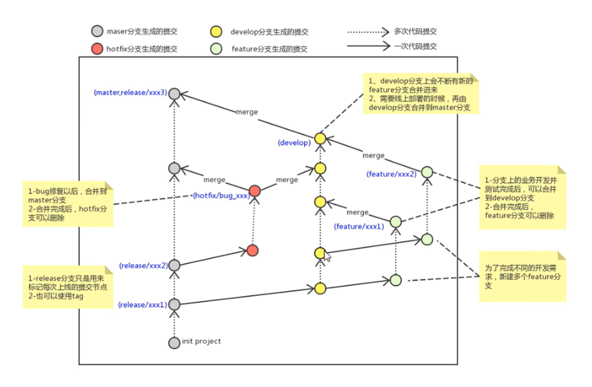

## Git远程仓库
经过前面的学习我们知道了存在两种仓库：即`本地仓库`和`远程仓库`。那么如何搭建远程仓库呢？

我们需要借助互联网上提供的代码托管服务，如`gitee`、`github`、`gitlab`，其中前两个我们在日常学习中很常见，第三个一般出现在企业、学校等内部网络搭建git私服，它是一个用于仓库管理系统的开源项目，使用git进行代码托管，并在此基础上搭建web服务。

### 搭建远程仓库
给本地仓库添加远程仓库有两种方式，一种是添加https方式，另一种是ssh密钥方式（前者比较简单，这里我们不做赘述，主要学习一下ssh密钥方式）。

- 首先生成ssh密钥
  - ssh-keygen -t rsa
  - 不断回车即可（若之前生成过密钥，则自动覆盖）
- 远程仓库设置密钥
  - 获取本地密钥
  - cat ~/.ssh/id_rsa.pub
  - 验证是否配置成功
    - ssh -T git@github.com 或者 ssh -T git@gitee.com

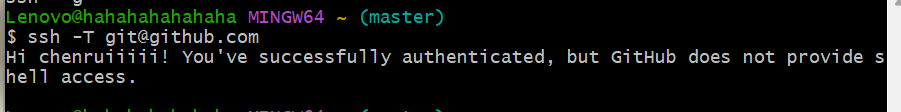
出现图示输出则说明配置成功！

### 远程仓库相关命令
1. 添加远程仓库
   - `git add remote <远端名称> <仓库地址>`
     - 例：git remote add origin git@github.com:zhangjunyi/git.git
2. 查看远程仓库
   - `git remote`
3. 推送到远程仓库
    - `git push [-f] [--set-upstream] [远程仓库] [本地分支]:[远程分支]`
    - 例：git push origin master
      - 若本地分支与远程分支名称一致这可只写本地分支 例：git push origin master
      - `-f` 强制推送 覆盖远程仓库
      - `--set-upstream` 讲本地分支与远程分支建立联系
    - 如果当前分支和远程分支已经建立联系，则只需执行`git push`即可

# Git常见问题解决
## 首次添加远程仓库
> **场景：本地分支已存在，远程分支也已存在，但未建立联系**

首次添加远程仓库时，我们的本地分支与远程分支未能建立联系，从本地`master`切换到`远程master`时会出现`Git:fatal:a branch named 'master'already exists`的错误！

1. 查看当前分支
    查看当前位于什么分支，保证下面之后操作的分支正确；
2. 与远程分支建立联系
   将当前分支与远程origin/master分支建立联系
   > git branch --set-upstream-to=origin/master
   > 
   > 简写：git branch -u origin/master
3. 查看是否建立联系
    > 查看所有分支的状态
   > 
    > git branch -vv
   > 查看当前分支的状态
   > git status

    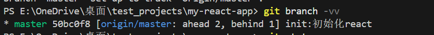

4. 解决之后的错误
之后可能会出现`fatal: refusing to merge unrelated histories`的问题，解决方法如下：
> git pull origin master --allow-unrelated-histories

这样问题就基本解决了！

