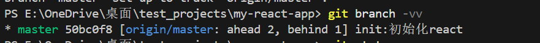
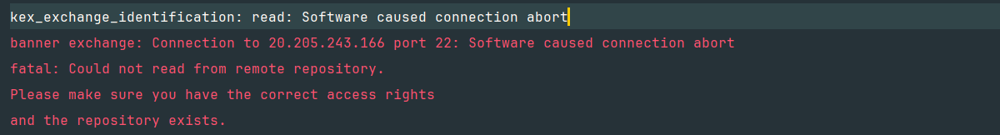
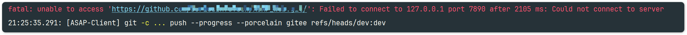

# Git常见问题解决
## 首次添加远程仓库
> **场景：本地分支已存在，远程分支也已存在，但未建立联系**

首次添加远程仓库时，我们的本地分支与远程分支未能建立联系，从本地`master`切换到`远程master`时会出现`Git:fatal:a branch named 'master'already exists`的错误！

1. 查看当前分支
   查看当前位于什么分支，保证下面之后操作的分支正确；
2. 与远程分支建立联系
   将当前分支与远程origin/master分支建立联系
   > git branch --set-upstream-to=origin/master
   >
   > 简写：git branch -u origin/master
3. 查看是否建立联系
   > 查看所有分支的状态
   >
   > git branch -vv
   > 查看当前分支的状态
   > git status

   

4. 解决之后的错误
   之后可能会出现`fatal: refusing to merge unrelated histories`的问题，解决方法如下：
```bash
git pull origin master --allow-unrelated-histories
```

这样问题就基本解决了！

## connection abort
有时候使用ssh方式推送代码的时候会出现下面的错误😅：



<span style="color: red;">原因<span>：

代理服务商为了安全考虑，避免被别人当跳板，会限制22端口的连接，导致无法正确连接到Github的服务器。

**解决办法：**
改走HTTPS协议，走443端口，这样不仅可以解决上面的问题，还可以提高代理的下载速度。
在`~/.ssh/config`中添加以下内容：

```bash
Host github.com
    Hostname ssh.github.com
    Port 443
    User git
```
之后就可以正常拉取推送了！

##  Failed to connect to 127.0.0.1
有时候可能会出现下面的错误❌：


查看git有没有proxy
```bash
git config --global http.proxy
git config --global https.proxy
```
如果有代理，取消之后就可以正常拉取推送了！

```bash
git config --global --unset http.proxy
git config --global --unset https.proxy
```

## refusing to merge unrelated histories
刚学习使用git的时候可能会犯的错就是：本地`git init`了仓库，远程仓库同样也初始化了，这就会导致两个仓库的历史提交是完全独立的。

一个`Git`仓库好比是一棵树，树上的每个节点就是一次提交。正常情况下，当在一个仓库中工作，操作也都是在同一棵树上不同的分支上进行推送和拉取。`Git`可以轻松的追踪这些分支的演变，因为他们都来自同一个根（即最初的提交）。

但是如果出现“不相关的历史记录”，就好像把两颗长在不同地方的树进行合并，`Git`无法找到共同的起点来理解这两个库的关系，所以会拒绝执行合并。

**解决办法：**
1. 常见方法：`--allow-unrelated-histories` 强制执行合并
    ```bash
   git pull origin <branch_name> --allow-unrelated-histories
   ```
2. 新项目中
   如果是在新项目中，我们可以先`git clone`把仓库代码拉到本地，之后在克隆的仓库中拉取和推送。这样可以确保本地仓库在一开始就跟远程仓库拥有相同的历史。


## 携带未提交的更改到另外分支
在改项目代码的时候添加了新功能一些的尝试，但是尝试还需要很长时间才能完成，这时候还有其他需求等待完成，所以不得需要先将更改保存起来（放入其他分支）

我们可以通过`stash`暂时保存当前更改，切换到其他分支之后再恢复更改；
1. 保存更改到`stash`条目
    ```bash
   git stash save "临时保存dev-添加列表滚动加载" # 可选：添加描述信息
   # 或者简化命令
   git stash push -m "临时保存dev-添加列表滚动加载"
   ```
   保存更改的时候注意`components.d.ts`，它会阻碍其他文件提交到`stash`(本来一次`stash`就可以了，因为这个文件会多几次`stash`)

2. 切换分支21
    ```bash
   git checkout -m feature-scrollbar
   ```

3. 从`stash`恢复到当前分支
    ```bash
   git stash pop # 获取最新stash条目并删除
   git stash apply stash@{0} # 只获取不删除
   ```


