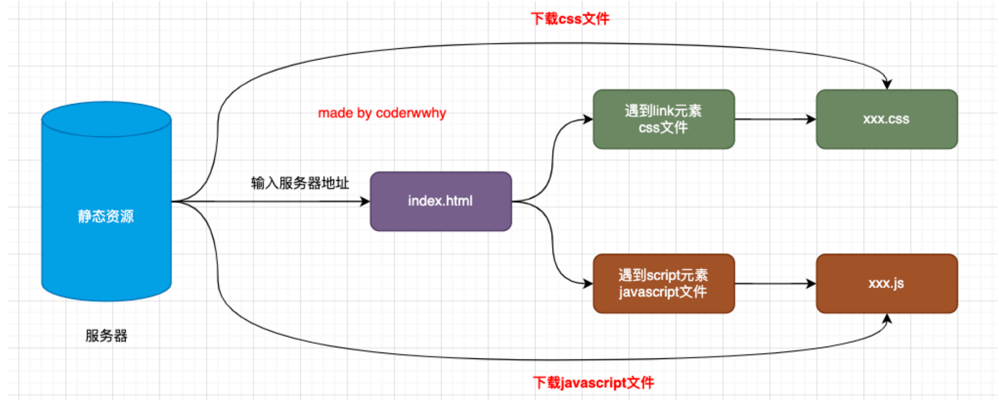
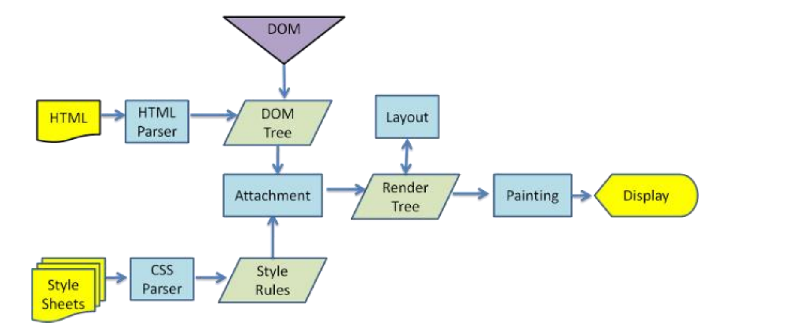
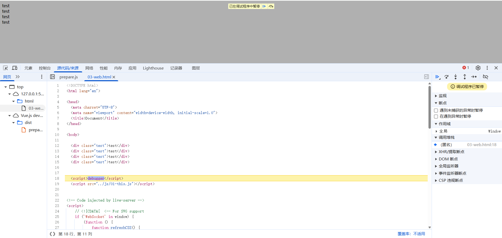
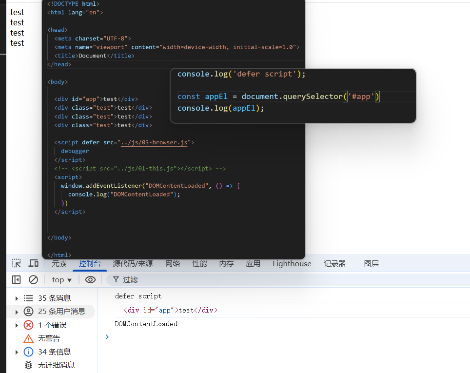

从输入路径开始，浏览器是怎样一步步渲染出页面的呢？

# 网页的解析过程
输入地址 ---> DNS解析 ---> 服务器响应 ---> 浏览器响应
一个网页URL从输入到浏览器中，到显示经历怎样的过程呢？

## 浏览器内核
常见的浏览器内核：

我们常说的`浏览器内核`指的是浏览器的`排版引擎`，也称之为`页面渲染引擎`或`样板引擎`。
# 浏览器渲染流程
详细内容可看我的另一篇博客：
[浏览器渲染原理](https://blog.csdn.net/2302_79523175/article/details/140614526?spm=1011.2415.3001.5331)

## 解析html
因为默认情况下服务器会给浏览器返回index..html文件，所以解析HTML是所有步骤的开始：
解析HTML，会构建DOM Tree:

## 生成css规则
浏览器在解析html时遇到 css 的`<link>`时会开启另外一个线程对css文件进行下载，这也就不会影响到dom tree的生成；
下载完css文件后就会对其进行解析，生成对应的`cssom`树。

## 构建render tree
当有了`DOM Tree`和`CSSOM Tree`两部分之后，就可以结合来生成`Render Tree`了。

注意❗️
1. `link`元素不会阻塞`DOM Tree`的构建，但是会阻塞`Render Tree`的构建，因为构建`Render Tree`需要对应的`CSSOM Tree`；
2. **`DOM Tree`和`Render Tree`并不是一一对应的**，有些dom可能设置了`display: none;`，不会在`Render Tree`中出现。

## 布局(Layout)
布局是确定呈现树中所有节点的宽度、高度和位置信息

`Render Tree`形成之后，就可以对dom的style进行计算：
1. `em`、`rem`或`%`等转换成`px`；
2. ...

## 绘制(Paint)
- 在绘制阶段，浏览器将布局阶段计算的每个frame转为屏幕上实际的像素点；
- 包括将元素的可见部分进行绘制，比如文本、颜色、边框、阴影、替换元素（比如img）

# 回流和重绘
## 回流reflow
###  （1）理解：
- 第一次确定节点的位置和大小叫做布局(Layout)；
- 之后对于节点大小以及位置等的计算叫做回流。
### （2）出现情况
1. `DOM`结构发生改变（添加新节点或者移除节点）；
2. 布局改变（修改了width、height、padding等值）；
3. 窗口resize（修改了窗口的尺寸）；
4. 调用`getComputedStyle`方法获取尺寸、位置信息；
## 重绘repaint
###  （1）理解：
- 第一次渲染内容叫做绘制(Paint)；
- 之后重新渲染叫做重绘（repaint）。
### （2）出现情况
1. 修改背景色、边框颜色、文字颜色、模糊样式等
2. `回流`一定引起`重绘`，所以回流是很**消耗性能**的事情。

**所以在开发中要尽量避免回流**：

1. 修改样式时尽量一次性修改
	- 比如通过`cssText`修改，通过添加`class`修改。
2. 尽量避免频繁的操作DOM
	- 我们可以在一个`DocumentFragment`(了解即可)或者是父元素中将要操作的DOM操作完成，在一次性的操作。
3. 尽量避免通过`getComputedStyle`获取尺寸、位置等信息
4. 对某些元素使用`position`的`absolute`或`fixed`
	- 这种操作并不是不会引起回流，而是相对来说开销较小，不会对其他元素造成影响。
# 特殊解析composite合成 和性能优化
绘制的过程，浏览器会将布局后的元素绘制到多个合成图层中（这是浏览器的一种优化手段）；
- 默认情况下，标准流的元素会被绘制到同一个图层中；
- 而某些特殊的属性，会单独创建一个新的合成层，并且新的图层可以使用`GPU`加速绘制（每个合成层都是单独进行渲染）

**哪些属性可以形成新的合成层呢**？下面是常见的一下属性：

- 3D transforms
- `video`、`canvas`、`iframe`
- `opacity`动画转换
- `position: fixed`
- `will-cahnge`：一个实验性的属性，提前告诉浏览器可能会发生哪些变化
- `animation`或`transition`设置了`opacity`、`transform`

注❗️：
分层确实可以提高性能，但是它以内存管理为代价，因此不应作为web性能优化策略的一部分过度使用！
# defer和async属性
首先来了解一下 **`script`和页面解析的关系** !

前面我们已经知道了，浏览器在解析html时遇到`<link>`不会影响`DOM Tree`的构建，那遇到`<script>`呢？会影响吗？
答案是：**会的！**
- 浏览器在遇到`<script>`时会先停止对`DOM Tree`构建，转而去下载、执行js脚本；
- 只有js脚本执行完毕后，`DOM Tree`才能继续进行构建；

那这是为什么呢？

- 因为js文件中可能存在对`DOM`的操作；
- 若先构建`DOM Tree`，再执行js脚本，可能会造成严重的回流和重绘，影响页面性能。

但是这也会带来新的问题，特别是现在主流框架：

- 目前主要流行的`Vue`、`React`，脚本往往比html页面更"重"，处理时间更长，
- 也就是在js脚本执行结束前，页面可能出现空白

（有些浏览器可能对此做了优化，也就是在js脚本执行接受之前，先将已经构建的`DOM Tree`进行展示）

为了解决这个问题，`<script>`给我们提供了两个属性：`defer`和`async`
## 4.1 defer
- defer会告诉浏览器不要等待脚本的下载，继续执行`DOM Tree`的构建
- 脚本的下载有浏览器完成，不会影响`DOM Tree`的构建；
- 若脚本先下载完，那它会等待`DOM Tree`构建完成，在`DOMContentLoaded`事件执行前执行defer中的代码

总结：
1. `defer`不会影响`DOM Tree`的构建；
2.  在`defer`中`DOM Tree`已经构建完成，可进行对dom的操作；
3. `defer`总是在`DOMContentLoaded`时间发出前执行；
4. 另外，有多个`defer`会按照编写顺序执行；
5. 从某种角度来说，`defer`会提高页面性能，并且推荐放在`<head>`中（提前下载js脚本）；
6. 注意：`defer`仅适用于外部脚本，对于`<script>`默认内容会被忽略。
## 4.2 async
- `async`和`defer`相似，都能够让脚本不堵塞页面；
- `async`是完全独立于浏览器的：
	- 浏览器页面不会因为`script`脚本而暂停`DOM Tree`的构建；
	- `async`脚本不能保证顺序执行脚本，它独立下载，独立运行，不会等待其他脚本；
	- `async`不一定在`DOMContentLoaded`时间执行前执行

**总结：**
1. `defer`通常需要在文档解析后操作`DOM`的`javascript`代码，并且对多个`script`文件有顺序要求；
2. `async`通常用于独立的脚本，对其他脚本，甚至`DOM`没有依赖的。

注：整个JS高级专栏依托于coderwhy老师的课程，相关图片、代码均来自于其课程。

