上篇博客了解了一下浏览器的运行原理，那javascript的运行原理又是怎么样的呢？

# V8引擎
先来了解一下V8引擎:

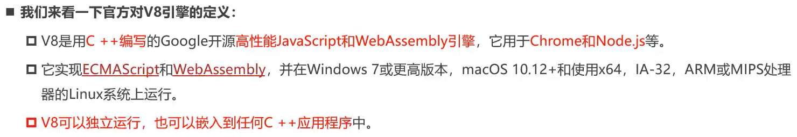

简单来说，V8引擎就是在做**将`javascript`代码转换成机器语言**，从而被cpu识别继而运行的工作。

## 执行原理与架构（了解）
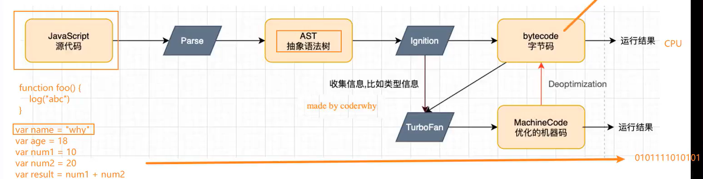
V8引擎本身的源码非常复杂，大概有超过100w行C++代码，通过了解它的架构，我们可以知道它是如何对)vaScript执行的：

 - `Parse`：将`javascript`代码转换成`AST抽象语法树`，因为解释器并不直接认识js代码；

	- 如果函数没有被调用，那么就不会被转成`AST`
 - `lgnition`：是一个解释器，会将`AST`转换成字节码；

	- 同时会收集`TurboFan`需要的类型信息（比如函数参数的类型信息，有了类型才能进行真实的运算）
	- 如果函数只执行一次，那么将直接解释执行字节码

 - `TurboFan`：是一个编译器，可以将`AST`转换成CPU直接能运行的机器码；

	- 如果一个函数被多次调用，那么将会被标记为`热点函数`，那么就会经过`TurboFan`编译成优化的机器码，提高代码的执行性能；
	- 但是，**机器码实际上也会被还原成字节码**，这是因为如果后续执行过程中类型发生了变化，之前优化的机器码并不能正确的运算，就会逆向的转成字节码

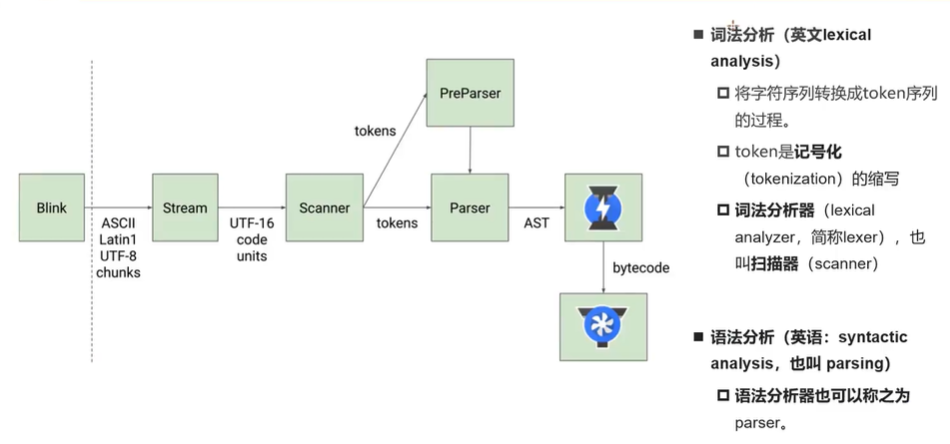
# javascript 执行过程

假设现在有段这样的代码，它应该是怎样执行的呢？
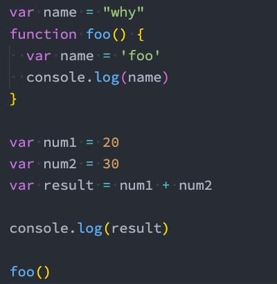

我们先来了解一下相关的基础知识！
## 初始化全局对象
- 首先，`js` 在执行代码前，会创建一个全局对象：`Global Object`
	- 该对象 所有的作用域都可以访问；
	- 里面还会包含`Date`、`Array`、`Number`、`setTimeout`、`setInterval`等；
	- 其中还有一个属性指向`window`

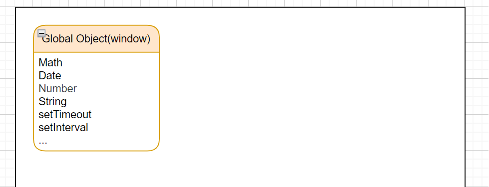
## 执行上下文栈
js 引擎内部有一个`执行上下文栈`（Excution Context Stack，简称ECS），是用于执行代码的调用栈。

- 那么现在要执行的是谁呢？是全局的代码块：
	- 全局的代码块在执行前会创建一个`Global Excution Context（GEC）`；
	- `GEC`会被放到`ECS`中执行

- `GEC`被放到`ECS`中包含两部分内容：
	- 第一部分：在代码执行前，在`parser`转成`AST`的过程中，会将全局定义的变量、函数等加入到`Global Object`中，但并不会赋值；（这个过程也叫做变量的作用域提升）
	- 在代码执行中，对变量赋值，或者执行其他的函数；

# 全局代码的执行
先来认识一下`VO对象`：
- 每个执行上下文都会关联一个VO（Variable Object，变量对象），变量和函数声明会被添加到这个VO对象中；
- 当全局代码被执行的时候，VO就是GO对象了。

❗️❗️❗️问题来了！**全局代码如何被执行呢？**

**执行前：**
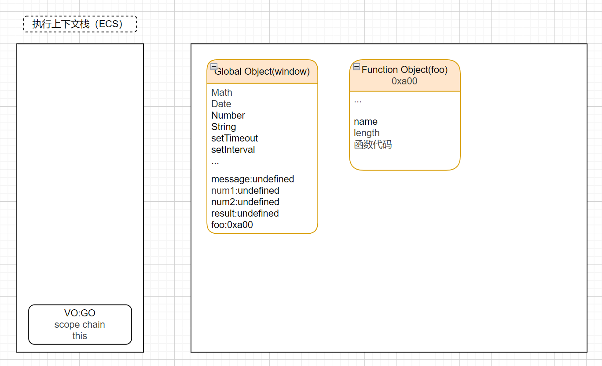
**执行后：**
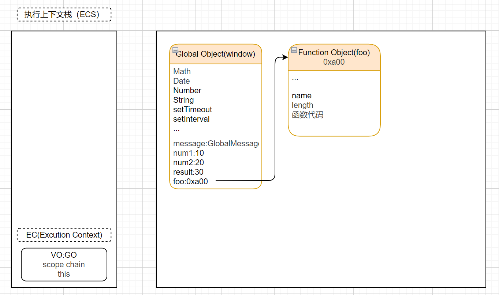
现在更改代码为：
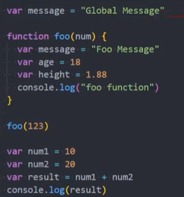

那就又有一个问题：**函数代码如何执行呢？**
# 函数代码的执行

- 执行代码遇到函数体时，就会根据函数体创建一个函数体上下文（Functional Excution Context），并且压入到ECS中；
- 当进入函数体执行代码时，就会创建一个`AO（Activation Obejct）`；
- 这个`AO`会使用`arguments`作为初始化，并且初始值是传入的参数；
- 这个`AO`对象会作为该函数体的执行上下文的`VO`来存放变量的初始化

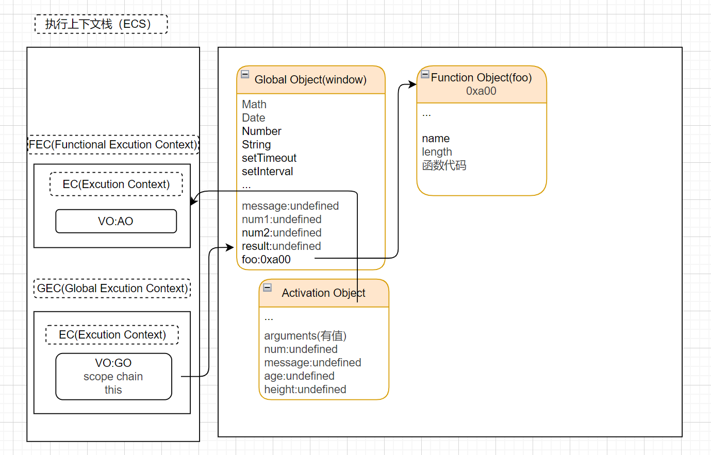

执行函数上下文之后：

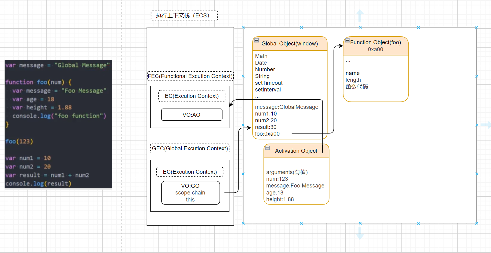

之后，函数执行上下文将会被压出栈外：

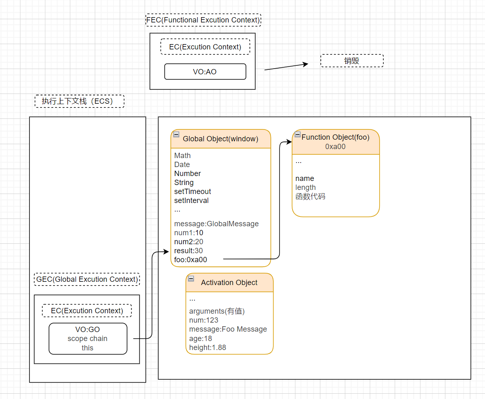

❗️在函数作用域中可能遇到这样的情况：

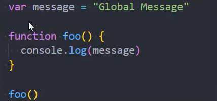

> `message`变量的声明存在于全局作用域，但在局部作用域进行了调用，**那局部作用域又是怎么找到全距作用与中的变量呢？**

这就涉及到了`javascript`的作用域和作用链！

# 作用域和作用链
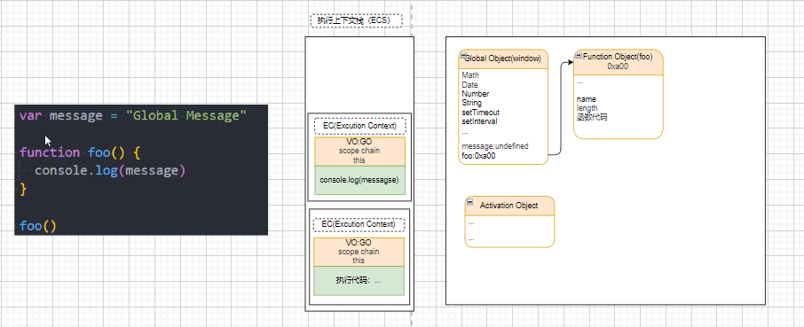

上面说到，但我们进入一个执行上下文时，执行上下文会关联一个VO对象，其实，同时它也会关联一个 **`作用域链（Scope Chain）`**。

- 作用域链是一个对象列表，用于表示变量标识符的求值；
- 当进入一个执行上下文时，这个作用域链就会被创建，并且根据代码类型，添加一系列的对象 

