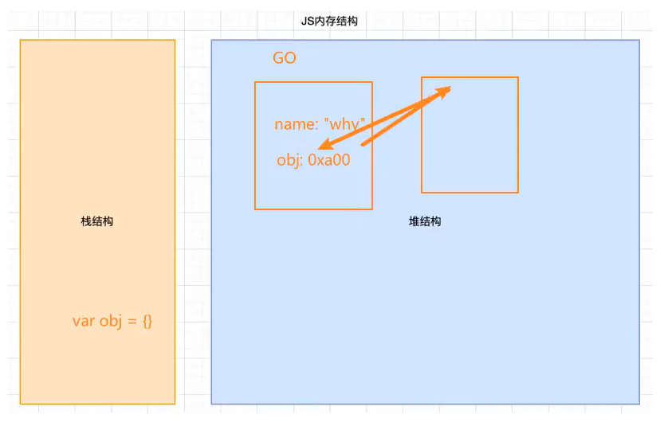

# javascript 内存管理
> 认识内存管理

不管什么样的编程语言，**在代码执行过程中都需要进行内存分配**，不同的是有些编程语言需要我们自己手动进行内存配置，有些则会自动帮我们进行内存分配。

不管什么样的内存分配机制，**内存的分配都会进入如下周期**：

1. 申请分配内存
2. 使用分配的内存
3. 不需要使用时释放内存

不同的语言会对第一步和第三步进行不同的处理：

- 手动管理内存：比如`C`、`C++`，包括早期的`OC`，都是需要手动的进行内存的申请和释放（`malloc和free函数`）；
- 自动管理内存：比如`java`、`javascript`、`Python`、`Swift`、`Dart`等，这些语言都有帮我们自动进行内存管理。

也就是说，我们所使用的`javascript`会自动的对原始值、对象、函数等进行内存管理，我们并不需要进行多余的操作。

# 垃圾回收机制

# 闭包的概念理解

# 闭包的形成过程

# 闭包的内存泄漏

