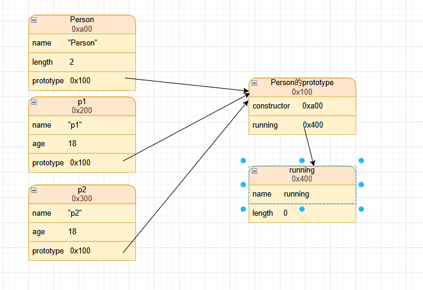
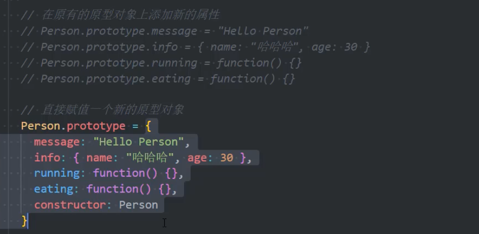
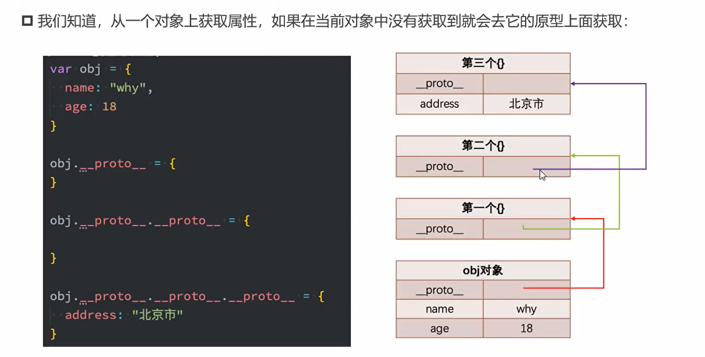
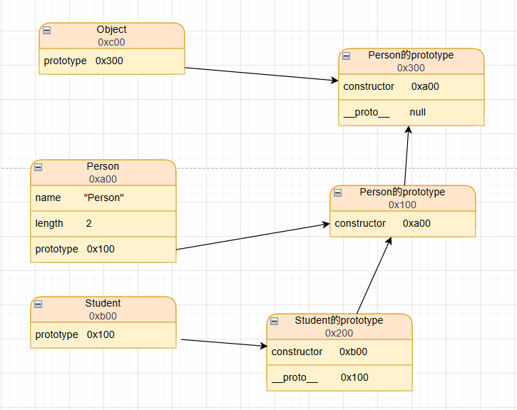
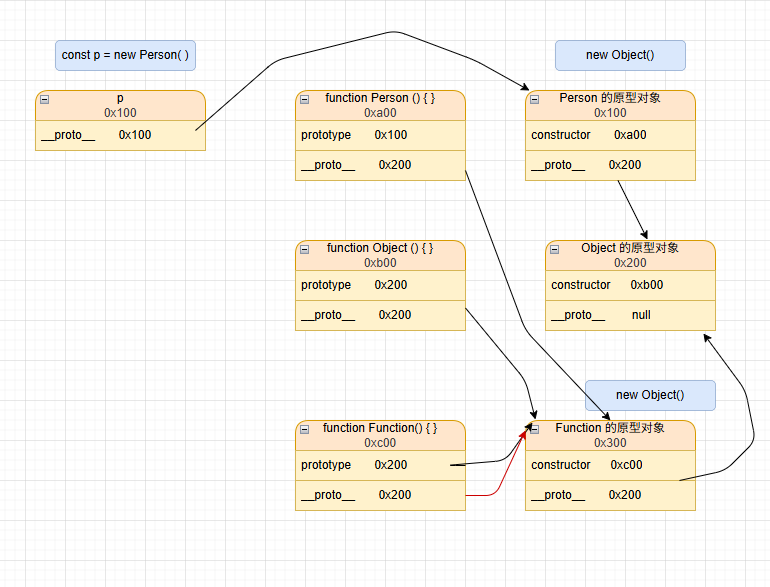
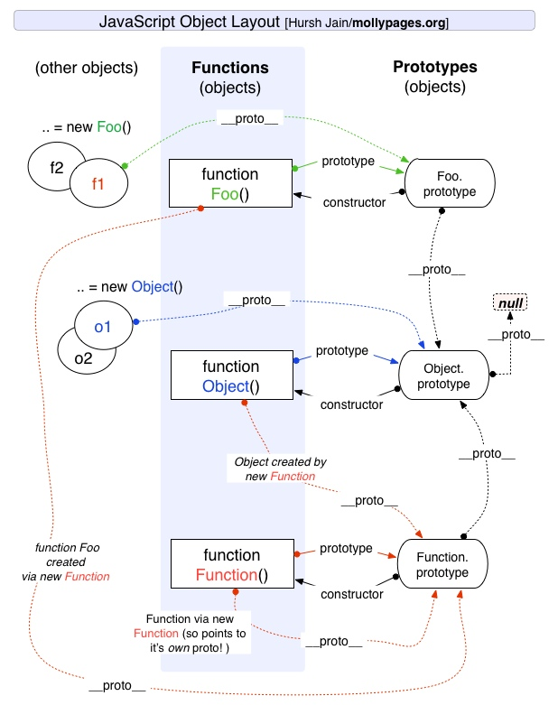

认识一下原型和原型链。

# 1. 认识原型

**原型是什么？怎样获取？**

## 1.1 ES5 -- **对象**的原型
每个对象身上都有一个[[prototype]]内置属性，这个特殊的对象可以指向另外一个对象。

- 当我们通过引用对象的`key`来获取`value`时，就会触发[[Get]]操作；
- 这个操作首先会在对象本身进行寻找，如果有的话就使用它；
- 没有的话就在对象的[[prototype]]属性指向的对象中寻找，如果还没有的话就继续找对象[[prototype]]属性指向的对象的[[prototype]]属性指向的对象中寻找，直到找到或者找不到为止。

**获取对象原型的方法**
1. `__proto__`属性
   > obj.__proto__
   > 这种方式存在浏览器的兼容性问题，所以不建议使用；
2. getPrototypeOf()
   > Object.getPrototypeOf(obj)
   > 同样的，设置原型可使用setPrototypeOf(对象，对象要指向的原型)方法；
```javascript
    const obj = {
    name: 'prototype'
}

console.log(obj);

console.log(obj.__proto__);
console.log(Object.getPrototypeOf(obj));
console.log(obj.__proto__ === Object.prototype); // true
```
## 1.2 ES5 -- **构造函数**的原型

函数本身也是对象，它身上有一个`[[prototype]]`属性，这个属性是一个对象，这个对象就是函数的实例对象。

区别于对象的获取方式，函数的`[[prototype]]`属性是**显式原型**，而函数对象的`__proto__`是**隐式原型**；

通过`new`关键字创建对象：
1. 创建空对象；
2. 将空对象赋值给this；
3. 将对象的显式原型赋值给隐式原型；

**案例:**
```javascript
function Student(name, age) {
  this.name = name;
  this.age = age;

  this.studying = function () {
    console.log(this.name + ' is studying');
  }
}

const s1 = new Student('xuexi', 18);
const s2 = new Student('student', 18);

console.log(s1.studying === s2.studying); // false
```
- 若这样定义函数，那么每次通过`new`创建对象时都会创建一个新的`studying`方法；
- 但若是将该方法定义在`Student.prototype`对象中，那么`studying`方法只会创建一次，所有对象实例都会共享这个方法。

```javascript
Student.prototype.studying = function () {
  console.log(this.name + ' is studying');
}
const s1 = new Student('xuexi', 18);
const s2 = new Student('student', 18);

console.log(s1.studying === s2.studying); // true
```

函数的显式原型对象`[[prototype]]`上有一个`[[constructor]]`属性，和这个属性指向函数本身。
```javascript
console.log(Student.prototype.constructor === Student); // true
```

**案例：**
```javascript
function Person(name, age) {
  this.name = name
  this.age = age
}

const p1 = new Person('p1', 18)
const p2 = new Person('p2', 20)

Person.prototype.running = function () {
  console.log(this.name + ' is running')
}
```



查找某个属性时，首先在对象本身中寻找，如果没有再在原型对象上寻找，如果没有再在原型对象的原型对象上（Object.prototype）寻找，直到找到或者找不到为止。

## 1.3 ES5 -- 重写原型对象（不推荐）
如果要在原型对象上添加很多属性，那么我们一般会重写原型对象。



我们可以通过上面的方法重写原型对象，但注意不要忘记添加`[[constructor]]`属性。

在重写前我们发现原型对象的`[[constructor]]`的属性描述符是不可枚举的：
```javascript
console.log(Object.keys(Person.prototype))  // ['running']
```

但是按照我们重写的方式来看，`[[constructor]]`属性也将会被枚举，所以我们需要通过属性描述符对这个属性进行更改。

```javascript
Object.defineProperty(Person.prototype, "constructor", {
  configurable: true,
  value: "Person",
  enumerable: false,
  writable: true
})
```

# 2. 原型链
## 2.1 ES5 -- 默认对象的原型链
 


当在对象身上查找某个属性时，会现在真神寻找，自身没有会在原型`__proto__`上寻找，如果没有的话会在原型的原型`__proto__`上寻找，最终查找到`Object.prototype`,它指向`null`,直到找到或者找不到为止。

```javascript
const obj = {};
// 相当于  const obj = new Object(); 构造函数的原型
// 即 obj.__proto__ = Object.prototype;
```

## 2.2 ES5 -- 利用**原型链**实现继承

现定义一个`Person`类，定义一个`Student`类，实现`Student`继承`Person`。

```javascript
function Person(name, age) {
    this.name = name;
    this.age = age;
}
Person.prototype.say = function () {
    console.log('hello world');
}
function Student(name, age) {
    this.name = name;
    this.age = age;
}
Student.prototype.say = function () {
    console.log('hello world');
}

Student.prototype.studying = function () {
    console.log(this.name + ' is studying');
}

```
1. 方式一 -- `Student.prototype = Person.prototype;`

   这种方式会产生问题：
      本来只有`Student`类才有的studying方法，但是通过这种方式，`Student`类和`Person`类都拥有studying方法。也就没有实现继承。
   
2. 方式二 -- `Student.prototype = new Person();Student.prototype = p;`

   这种方式将`Student`类的studying方法放在`p`对象身上，而`Person`原型上没有，实现了继承。

## 2.3 ES5 -- 借用**构造函数**实现属性继承
```javascript
// 在利用原型链实现继承的基础上
function Student(name, age) {
    Person.apply(this,name,age)
    this.name = name;
    this.age = age;
}

const student = new Student("chender", 22)
```

**组合继承的弊端**
1. 创建对象时，会调用两次父类的构造函数，一次是`Student.prototype = new Person();`，一次是`Student.prototype = p;`；
2. 所有的子类实例都有两份父类的属性，一份在自身，一份在原型上；

## 2.4 ES5 -- 原型式继承函数
从上面的例子中可以发现，想要实现继承就需要将父类和子类连接起来：
1. 创建新对象；
2. 将新对象的原型指向父类原型；
3. 子类原型指向所创建的对象；

```javascript
function createObj(o){
//     无兼容性创建对象方式
   function F(){}
   F.prototype = o
   return new F()
   
//    有兼容性创建方式：
//    return Object.craete(SuperType.prototype)
}

function inderit(SubType, SuperType){
    SubType.prototype = craeteObj(SuperType.prototype)
    Object.defineProperty(SubType.prototype, "constructor", {
       enumerable:false,
       configurable: true,
       writable:true,
       value: SubType
   })
}
```

**继承的最终写法(寄生组合式继承)：**
```javascript
function Person(name, age) {
   this.name = name;
   this.age = age;
}

Person.prototype.eating = function () {
   console.log('eating')
}

function Student(name, age, sex, grade) {
   Person.apply(this, [name, age])
   this.sex = sex;
   this.grade = grade;
}

function createObj(o) {
   function F() { }
   F.prototype = o
   return new F()

   //    return Object.create(o)
}

function inherit(SubType, SuperType) {
   SubType.prototype = createObj(SuperType.prototype)
   Object.defineProperty(SubType.prototype, "constructor", {
      enumerable: false,
      writable: true,
      configurable: true,
      value: SubType
   })
}
```

**补充 -- 寄生式继承函数**
- 寄生式(Parasitic)继承是与原型式继承紧密相关的一种思想，并且同样由道格拉斯·克罗克福德(Douglas Crockford)提出和推
广的；
- 寄生式继承的思路是结合原型类继承和工厂模式的一种方式；
- 即创建一个**封装**继承过程的函数，该函数在内部以某种方式来增强对象，最后再将这个对象返回；



从图中可以看出，`Student`继承自`Person`，同样的，`Person`也继承自`Object`，可得<font color="red">**`Object`是所有类的子类**</font>。

## 2.5 ES5 -- 对象补充方法
1. hasOwnProperty() -- 判断某个属性是否存在于对象自身，而不是原型的
   > obj.hasOwnProperty("name")
2. in操作符 -- 判断某个属性是否存在于对象身上（包括原型）
   > "name" in obj
   
   for...in 可遍历对象的所有可枚举属性，包括原型上的属性
3. instanceof -- 用于检测构造函数的`prototype`
   ```javascript
   function Person(name, age) {}
   function Student(name, age) {}
   inherit(Student, Person)
   const p = new Student("chender", 22)
   console.log(p instanceof Student) // true
   console.log(p instanceof Person)  // true
   console.log(p instanceof Object)  // true
   ```
4. isPrototypeof() -- 用于判断某个对象是否出现在某个实例对象的原型链上 （了解即可）
   > Student.prototype.isPrototypeof(p)   // p是否在Student.prototype的原型链上

# 3. 原型关系
## 3.1 原型继承关系图

[//]: # ()

图片来源：<a href="http://mollypages.org/tutorials/js.mp" >javascript_layout_tree</a>

**注：**
1. **所有函数（比如Person， Object）都是Function的实例对象**；
2. Function也是Function的实例对象；
3. 原型对象创建时默认其隐式原型指向Object的显式原型；
4. 推导得：Object是Person, Function的父类


**补充 -- 构造函数的类方法和实例方法：**
```javascript
function Person(name, age) {
    this.name = name;
    this.age = age;
}

// 实例方法
Person.prototype.eating = function () {
   console.log("eating")
}

// 类方法
Person.randomPerson = function (){
    return new Person("abc", 18)
}

const p1 = new Person("name", 18)
```
有了上面这段代码，现在来思考一个问题：
1. > Person.eating() 会执行吗？
   
   > 答案是 不会。
   > - 因为Person是Function的实例对象，是Object，且Person原型上没有eating方法，接着在Object原型上找也没有找到，所以会报错。
   > - 这种定义在构造函数原型上的方法就叫做实例方法（只有创建实例对象才能调用）。

2. > const p = Person.randomPerson() 会执行吗？

   > 答案是 会。
   > - 因为randomPerson方法在Person对象身上，直接调用即可获得；
   > - 这种定义在构造函数对象上的方法就叫做类方法。

## 3.2 ES6的`class`

### 3.2.1 class定义类
`ES6`新的标准中使用class关键字定义类。
```javascript
class Person{
    constructor(name, age){
        this.name = name;
        this.age = age;
    }
    
    // 实例方法
    // 本质是Person.prototype.eating = function(){}
    eating(){
       console.log("eating")
    }
    
//     类方法
    static sleeping(){
       console.log("sleeping")
    }
}
```

class方式定义类，创建对象和构造函数方式定义类创建对象本质上是一样，但class定义的类不能作为普通函数进行调用：

### 3.2.2 访问器

如何更灵活的对对象或者类的属性进行管理？我们可以使用`访问器`来实现。

1. 对象访问器
   ```javascript
   const obj = {
      "_name": "chen",
      get name(){
           return this._name
      },
      set name(value){
           this._name = value
      }
   }
   
   // 也可以使用Object.defineProperty()进行访问器定义
   Object.defineProperty(obj, "name", {
      configurable: true,
      enumerable: true,
      get(){},
      set(value){}
   })
   ```
   
2. 类访问器
```javascript
class Person{
   constructor(name){
       this.name = name
   }
   get name(){
        return this.name
   }
   set name(value){
        this.name = value
    }
}
```

## 3.3 extends实现继承
```javascript
class Person{
    constructor(name){
        this.name = name
    }
    say(){}
}

class Student extends Person{
    constructor(name, age){
        super(name)
        this.age = age
    }
}
```
**class中的`super`关键字：**
1. super.method(...) 来调用一个父类方法；
2. super(...) 来调用父类的constructor(...)

注：
1. 在子类中使用`this`或者返回默认对象前必须先通过`super`调用父类构造函数；
2. `super`的使用位置：构造函数、实例方法、类方法；
3. `super`只能调用同名函数，不能调用不同名函数；
   ```javascript
   class Student extends Person {
       // ...
       static sleep() {
           super.sleep()
           // super.eat()   // 报错
           console.log('sleeping')
       }
   }
   ```

 


