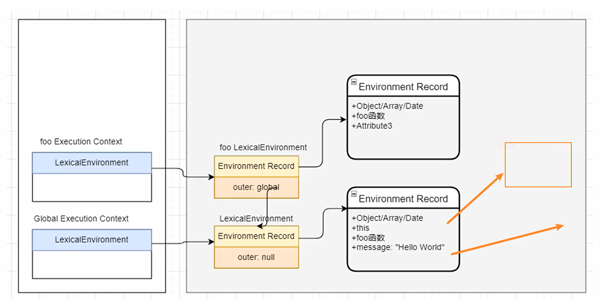

let / const 注意事项

1. 重复声明
    - `var` 可重复声明
    - `let` / `const` 不可重复声明
   ```javascript
   var message = 'hello world'
   var message = 'hello world!' // 不报错
   
   let address = 'beijing'
   let address = 'shanghai' // 报错
   
   const age = 18
   const age = 19  // 报错
   ```

2. 作用域提升
   ```javascript
   console.log(message) // undefined
   var message = 'hello world'
   
   console.log(address) // 报错
   let address = 'beijing'
   
   console.log(age)  // 报错
   const age = 18
   
   ```
   在创建执行上下文时，词法环境被创建，变量也被创建，但`var`定义的变量被初始化为`undefined`，`let`/`const`定义的变量未赋值，访问会报错。
3. 暂时性死区
   - 变量未被声明之前到作用域顶部，这块区域不能访问变量，会报错（叫做`暂时性死区`）。
4. window对象添加属性
   - `var`定义的变量会添加在`window`对象上;
   - `let`/`const`定义的变量不会添加在`window`对象上

   
   
   在全局语法环境中存在`obejct Environment Record` 和`declarative Environment Record`两个对象，前者是`window`对象，后者身上添加了`let`和`const`声明的变量。

5. 块级作用域
   - `ES6`中新增了块级作用域 `{ ... }` ，并且通过`let`、`const`、`function`、`class`声明的标识符是具备块级作用域限制的。
   ```javascript
   {
        let message = 'hello world'
        const age = 18
        function foo(){
            console.log(message)
        }
        class Person {  }
   }
   ```
   上面代码中只有`function` 可以在外部被访问到，这是因为引擎会对函数的声明进行特殊的处理，允许像`var`那样可以在外接访问 。


