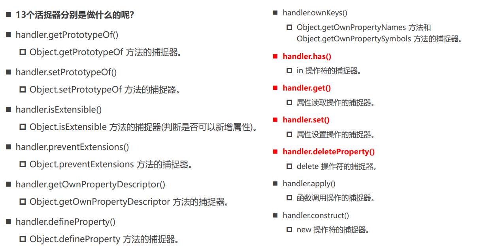
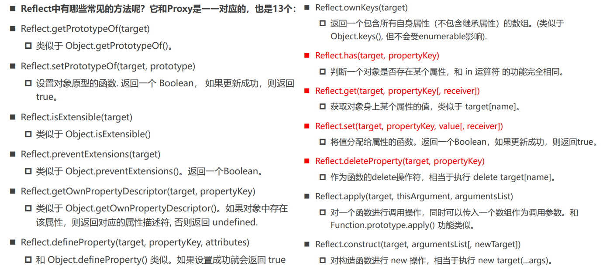

`Proxy`详解。

# 1. Proxy
**现在有一个问题：我们如何监听对象的操作？**

1. `Object.defineProperty()`
    之前我们会通过`Object.defineProperty()`来进行监听，
    ```javascript
    Object.defineProperty(obj, "name", {
      get() {
        return obj.name
      },
      set(value) {
        obj.name = value
      }
    })
    ```
    - `Vue2`实现响应式原理的核心就是通过`Object.defineProperty()`来实现的；
    - 但是`Object.defineProperty()`设计之初并不是为了监听某个属性；
    - 我们在定义某个属性时，初衷是定义某个普通属性，但是我们后面强行把它变成了数据属性描述符；
    - 而且`Object.defineProperty()`无法监听到新增属性和删除属性等操作
2. Proxy
   > new Proxy(target, handler)
   > - target: 目标对象
   > - handler: 处理函数

   ```javascript
   const objProxy = new Proxy(obj, {
     get(target, key) {
       return target[key]
     },
     set(target, key, newValue) {
       target[key] = newValue
     }
   })
   objProxy.name = 'hello world'
   // 之后操作obj可以通过objProxy来操作，可达到监听的目的
   ```

- 对某个对象行进行其他操作时，我们通过`Proxy`也可以监听到！
上面我们介绍了`set()`和`get()`两种`handler`，`handler`有13种捕获器（handler）：

除了上面两种常用的捕获器，还有以下两种常用的捕获器：
- `has()`：拦截`in`操作符；
```javascript
    const objProxy = new Proxy(obj, {
   // ...
   has(target, key) {
      console.log("has");
      return key in target
   },
})

console.log('in', name in objProxy); // in true
```

- `deleteProperty()`：拦截`delete`操作符；
```javascript
    const objProxy = new Proxy(obj, {
      // ...
      defineProperty(target, key, descriptor) {
        console.log("defineProperty");
        delete target[key]
      }
    })

    delete objProxy.name
    console.log(objProxy); // {age: 20}
```

下面几种了解即可：


# 2. Reflect
`Reflect`对象是`ES6`新增的对象。

- `Reflect`主要提供了一些操作`javascript`对象的方法，跟`Object`操作对象的方法类似；
   - 比如`Object.defineProperty()`和`Reflect.defineProperty()`
   - `Object.getPrototypeOf()`和`Reflect.getPrototypeOf()`

- 早期的ECMA规范没有考虑到这种对对象的操作是否规范就将这些API加在了`Object`上；
- 但是`Object`作为一个构造函数，这样设计是不安全的，所以ES6中新增了`Rfelct`，把这些对对象的操作方法都集中起来；
- 另外，在使用`Proxy`时不操作原对象

## 2.1 常用方法


**`Reflect`和`Proxy`共同实现代理：**
```javascript
const obj = {
    name: 'obj',
    age: 18,
    set(newValue) {
        console.log(this); // 默认为   this ---> obj
    }
}

const objProxy = new Proxy(obj, {
    get(target, key, receiver) {
        const result = Reflect.get(target, key)
        // const result = Reflect.get(target, key, receiver)   // 将obj中set()的this指向receiver
        return result
    },
    set(target, key, newValue, receiver) {
        // 之前  直接操作target对象
        target[key] = newValue
        // 有了Reflect
        const result = Reflect.set(target, key, newValue)
        if (result) {
            console.log("成功");
            target[key] = newValue
        } else {
            throw new Error('设置失败')
        }
    }
})
```
使用`Reflect`的好处：
1. 不再直接操作`target`对象；
2. `Reflect`的set等方法会返回boolean值，可以判断是否操作成功；
3. `Reflect.get(target, key, receiver) `可将obj中set()的`this`指向**receiver**(所创建的proxy对象)

 


