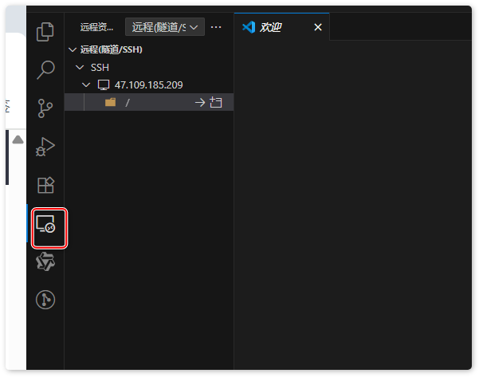

了解一下nginx的安装与配置，以及常见的nginx常用命令

# 1. 安装与配置
1. 阿里云申请免费云服务器，为nginx练习使用
2. 连接远程服务器
    - 首先重置root密码
    - 若是使用vscode 可安装 `remote ssh`插件 （用来连接远程服务器）
    - 连接到远程

3. 下载nginx 
    - cd /usr/local
    - wget https://nginx.org/download/nginx-1.28.0.tar.gz (若下载不成功可通过命令 `su` 切换到root用户)


    - tar -zxvf nginx-1.28.0.tar.gz
    - cd ./nginx-1.28.0
4. 初始配置及编译安装
    - 初始配置 ./configure
    - 编译源码 安装 make && make install
    
# 2. Nginx常见命令
```
user admin; # 规定启动nginx的用户
worker_processes 1; # Nginx 启动一个工作进程，适用于轻量部署或开发环境。
events {
   worker_connections 1024; 
}

http{
   include mime.types; # 文件类型映射
   default_type application/octet-stream; # 默认MIME类型
   sendfile        on;                            # 启用 sendfile 加速
   tcp_nopush      on;                            # 优化发送数据包
   keepalive_timeout  65;                         # 长连接超时
   client_max_body_size 10m;                      # 请求体大小限制

   include /etc/nginx/conf.d/*.conf;              # 引入子配置文件
   
   # 静态文件配置
   server {
      listen 8080 ssl;
      server_name localhost myTest.com;
      
      # 申请ssl证书 配置ssl证书
      ssl_certificate /path/to/cert.pem;
      ssl_certificate_key /path/to/cert.key;
      
      location / {
         root /usr/local/nginx/html/dist; # 相对静态资源路径
         index index.html inddex.htm;
      }
      
      location /api {
         # 设置CORS配置
         add_header Access-Control-Allow-Origin *;
         add_header Access-Control-Allow-Methods 'GET, POST, OPTIONS';
         add_header Access-Control-Allow-Headers 'Content-Type, Authorization';
         
         alias /usr/local/nginx/html/dist/api; # 绝对静态资源路径
         index index.html inddex.htm;
         
         if ($request_method = 'OPTIONS') {
            return 204;
         }
      }
   }
}

```

