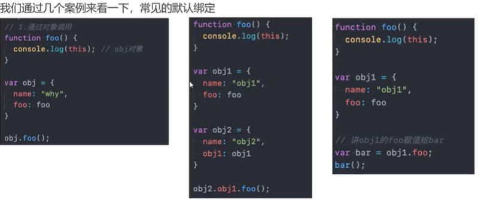
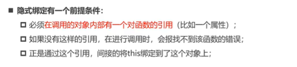
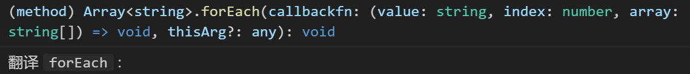
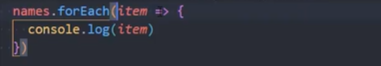
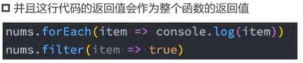
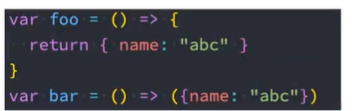

---
title: this的指向规则
date: 2025-05-14 18:30:24
categories:
  - 分类
tags:
  - js高级
abbrlink: 62d23d36
---
`this` 到底指向谁? 箭头函数中的`this`还能使用吗? 如果能使用又要怎么使用呢? 与普通函数的`this`指向一致吗?
## `this`到底指向谁？
首先，定义一个函数：

三种不同的调用方式，this的指向也会不同！

1. 直接调用

> foo()  // window{}
>

2. 通过对象调用

```html
var obj = { name: 'name' }
obj.foo = foo
obj.foo(); // Object{}     (obj这个对象)
```

3. call/apply/bind

> foo.apply("abc") //  String {'abc'}

**结论：**
1. 函数在调用时，js会**默认给this绑定一个值**；
2. this的绑定跟它**定义的位置（编写的位置）**没有关系；
3. this的绑定与调用方式以及调用的位置有关；
4. this是在运行时被绑定的。

## this`的绑定规则
### 默认绑定
+ 普通函数被独立调用

> foo()   // window{}

+ 函数定义在对象中，但是独立被调用

> var bar = obj.foo
> bar()  // window{}

+ <font style="color:#DF2A3F;">严格模式</font>下，独立调用的函数中的`this`指向`undefined`

```html
<script>
	"use strict"
	...
</script>
```

+ 高阶函数

> function test(fn) {
>
>     fn()
>
> }
>
> test(obj.foo) // window{}

即独立调用函数时(非严格模式下)`this`指向`window`!

### 隐式绑定
> 一般是通过**对象**来发起调用。
>





### 显式绑定
```javascript
foo.call(obj)
foo.apply(obj) // foo {name:'name'}
```

+ 这两种形式的显示绑定区别不大，不会像隐式绑定那样在obj上面添加foo:foo，但是foo的this就指向了obj；
+ 另外，这种形式一般将this绑定在对象身上，如果foo.call('abc')，那么也会默认将'abc'创建为对应的包装类型，这里也就是`String`对象;
+ 如果是绑定在了`undefined`这种没有对应包装类型的对象身上，那么this就会默认指向`window`

#### call / apply函数说明
```javascript
function test(name, age) {
  console.log('参数:', name, age);
}
```

作用：都可以调取函数并绑定this，传递参数方式不同

+ `apply(obj,[argumentsArray])`

`obj`是指this指向的对象；

`argumentsArray`是指函数的参数，必须要放在**数组**中进行传递；

```javascript
// apply
test.apply('apply', ['chenber', 18]) // 参数: chenber 18
```

+ `<font style="color:#DF2A3F;">call(obj,arg1,arg2,...)</font>`

`obj`是指this指向的对象；

`arg1,arg2,...`是指函数的参数列表。

```javascript
// call
test.call('call', 'chender', 18) // 参数: chender 18
```

#### bind
```javascript
// bind
var bar = test.bind('bind')
bar() // 参数:this,String{'bind}

var bar = test.call('call', 'chender', 18) // 参数: chender 18
bar() // 报错
```

`bind`是`绑定（怪异）函数`，是返回绑定过对象的函数，那么在执行的时候this只会指向绑定好的对象；

而`call`和`apply`都是直接执行函数，没有返回值 。

+ bind()的其他参数

```javascript
var bar = test.call('call', 'chender', 18)
bar() // 参数: chender 18
bar() // 参数: chender 18    （参数一开始就指定好了，修改不了）
```

❗️❗️❗️此时，会不会有疑问？（bar()函数单独调用，this不应该指向window吗？）

这里就涉及到了**this绑定的优先级**了！

1. 默认绑定优先级最低
2. 显式绑定 > 隐式绑定

```javascript
var obj = {
  name: 'chenber',
  age: 18,
  test: test
}

obj.test.apply('apply', ['1', 19]) 
// this [String: 'apply']
// 参数: 1 19
var test1 = obj.test.bind('bind', 'chenber', 18)
test1()
// this [String: 'bind']
// 参数: chenber 18
```

3. new 绑定 > 隐式绑定

```javascript
var obj = {
  name: 'chenber',
  foo: function () {
    console.log('foo:', this);
    console.log('foo:', this === obj);
  }
}
new obj.foo()
// foo: foo {}
// foo: false
```

4.  new > 显式(bind)

❗️`new`和`apply` / `call`不可以一起使用，所以没有可比性

`new`和`bind`可以一起使用

```javascript
function test() {
      console.log('test', this);
    }

    var testFN = test.bind('abc')
    new testFN() // test{}
```

### new绑定

使用new关键字来调用函数是，会执行如下的操作：
- 创建一个全新的对象；
- 这个新对象会被执行prototype连接：
- 这个新对象会绑定到函数调用的this上（this的绑定在这个步骤完成）；
- 如果函数没有返回其他对象，表达式会返回这个新对象：

总结(优先级从高到低)：
1. new
2. bind 
3. apply / call
4. 隐式
5. 默认绑定
## 内置函数的调用绑定
内置函数的this指向需要`根据一些经验`获取

1. setTimeOut()

```javascript
setTimeOut(()=>{
  console.log('this', this) //window
},1000)
```

2. 按钮的点击监听

```javascript
    var btn = document.querySelector('button')
    btn.onclick = function () {
      console.log('btn', this); // <button>点击</button>
    }
 btn.addEventListener("click", () => {
      console.log('btn', this); // <button>点击</button>
    })
    btn.addEventListener("click", () => {
      console.log('btn', this); // window
    })
```

3. forEach

forEach(function(){}, {})



forEach的两个参数：

1. 回调函数
2. 回调函数的this绑定对象

```javascript
const names = ["abc", "abc", "abc", "abc", "abc"]
names.forEach(function (item) {
  console.log('forEach', this); // window
})

names.forEach(function (item) {
      console.log('forEach', this); // String {'abc'}
    }, "cba")
```
## `this` 绑定之外的规则
1. 如果在使用显式绑定时传入`null`或者`undefined`，那么就会使用默认绑定规则

```javascript
    foo.apply(null) // window
    foo.apply(undefined) // window
```
严格模式差异：在严格模式下，绑定null/undefined时会直接使用传入值，this会指向null或undefined本身。

2. 间接函数引用（知道就行，一般不会出现）
```javascript
    var obj2 = {};
    (obj2.foo = obj.foo)() // window
```
3. 箭头函数(补充)
箭头函数是 `es6` 新增的一种函数的声明方法。
- 完整写法

```javascript
const foo = (name,age)=>{
	console.log("=>")
}
```
❗️注:

	- 	箭头函数不会绑定`this` 和 `arguments`(有新的属性进行代替)属性；
	- 	箭头函数不能作为构造函数来使用（会抛出错误）

- 箭头函数的简写
	- 只有一个参数时 可省略()

	- 函数体只有一行语句时，可省略{}，但是不能带return 关键字

	- 如果执行体只有返回一个对象，那么需要给这个对象加上()

## 箭头函数中的 `this` 使用
 **箭头函数的作用域没有 `this` ！**
 但是箭头函数中`this`会向寻找上层作用域中的`this`，直至找到全局this->`window`。

```javascript
const test = () => {
  console.log('this', this);
}
test() // window
var test1 = test.bind('abc')
test1() // window
var obj = {
	name: 'chenber',
	foo: () => {
        console.log('this', this);
      }
 }
obj.foo() // window
const test2 = obj.foo.bind('abc')
test2() // window
```
应用实例：

```javascript
   // 模拟网络请求函数
    function request(url, callbackFn) {
      const results = {
        code: 200,
        msg: '成功',
        data: null
      }
      callbackFn(results)
    }
    
    // 将获取的数据传输给obj的results
    var obj = {
      results: {},
      // 之前的写法：
      // getData: function () {
      //   var _this = this
      //   request('/test', function (res) {
      //     _this.results = res
      //   })
      // }

      // 使用箭头函数:
      getData: function () {
        request('/test', (res) => {
          this.results = res
        })
      }
    }
    obj.getData()
```


 

